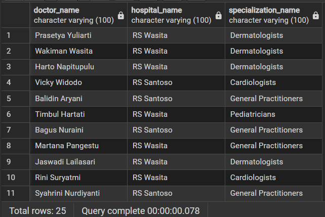
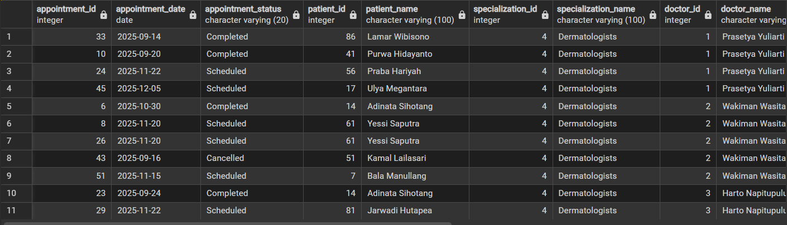
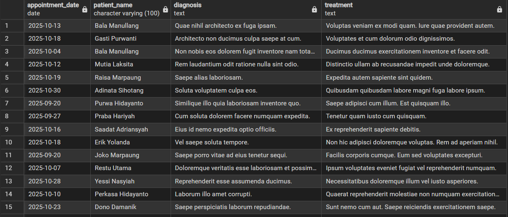
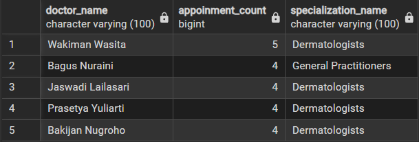
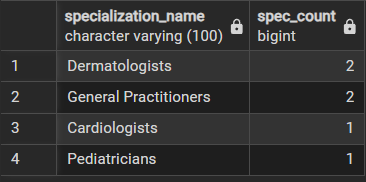
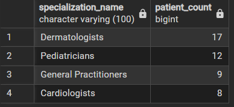

I design a simple database system for hospital app to manage patient medical records and doctor appointments with postgresql.

## Hospital Appointment System Database ERD


## Data Generation
All data in this project were synthetically generated using `Faker` and `random` library in Python.

## Sample SQL Queries
The following are sample `SQL` queries you can do on `hospital_app-db`.

### 1. Doctors with their hospitals and specializations
```sql
SELECT doctor_name, hospital_name
FROM doctors
LEFT JOIN hospitals
	ON  doctors.hospital_id = hospitals.hospital_id
LEFT JOIN specializations
	ON doctors.specialization_id = specializations.specialization_id
```
`Output`:
 

### 2. Patient's scheduled appointment

```sql
CREATE VIEW full_appointments AS
SELECT
    a.appointment_id,
    a.appointment_date,
    a.appointment_status,
    p.patient_id,
    p.patient_name,
	spec.specialization_id,
	spec.specialization_name,
    d.doctor_id,
    d.doctor_name,
    h.hospital_name,
    h.hospital_address,
    s.start_time AS slot_start_time,
    s.end_time AS slot_end_time
FROM appointments a
JOIN patients p
    ON a.patient_id = p.patient_id
JOIN appointment_slots s
    ON a.slot_id = s.slot_id
JOIN doctor_schedule ds
    ON s.schedule_id = ds.schedule_id
JOIN doctors d
    ON ds.doctor_id = d.doctor_id
JOIN hospitals h
    ON d.hospital_id = h.hospital_id
JOIN specializations spec
	ON d.specialization_id = spec.specialization_id;

SELECT *
FROM full_appointments
```

`Output`:


```sql
SELECT *
FROM full_appointments
WHERE appointment_status = 'Scheduled'
```

`Output`:


### 3. Patient's Medical Records

```sql
SELECT appointment_date, patient_name, diagnosis, treatment
FROM medical_records
JOIN appointments
	on medical_records.appointment_id = appointments.appointment_id
JOIN patients
	ON  appointments.patient_id = patients.patient_id
```

`Output`:


### 4. Creating new appointment
```sql
INSERT INTO appointments (patient_id, slot_id, appointment_date, appointment_status)
VALUES (7, 25, '2025-11-15', 'Scheduled');
```

### 5. Doctors with the most appointment

```sql
SELECT
	doctor_name, 
	COUNT(doctor_name) AS appoinment_count,
	specialization_name
FROM full_appointments
GROUP BY doctor_name, specialization_name
ORDER BY appoinment_count DESC
LIMIT 5
```
`Output`:


### 6. Doctors with the most 'completed' appointment
```sql
SELECT
	doctor_name, 
	COUNT(doctor_name) AS appoinment_count,
	specialization_name
FROM full_appointments
WHERE appointment_status = 'Completed'
GROUP BY doctor_name, specialization_name
ORDER BY appoinment_count DESC
LIMIT 5
```
`Output`:


### 7. Specializations with the most cancelled appointment

```sql
SELECT
	specialization_name,
	COUNT(specialization_name) AS spec_count
FROM full_appointments
WHERE appointment_status = 'Cancelled'
GROUP BY specialization_name
ORDER BY spec_count DESC
LIMIT 5
```
`Output`:



### 8. Specializations with the most patients
```sql
SELECT
	specialization_name,
	COUNT(DISTINCT patient_name) AS patient_count
FROM full_appointments
GROUP BY specialization_name
ORDER BY patient_count DESC
LIMIT 5
```
`Output`:


### 9. Number of Specialist in each hospital
```sql
SELECT
	hospital_name,
	specialization_name,
	COUNT(specialization_name) AS spec_count
FROM doctors
JOIN hospitals
	ON doctors.hospital_id = hospitals.hospital_id
JOIN specializations
	ON doctors.specialization_id = specializations.specialization_id
GROUP BY hospital_name, specialization_name
ORDER BY hospital_name, specialization_name, spec_count
```
`Output`:
